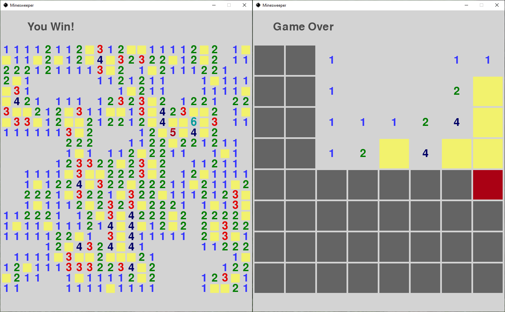
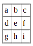

# Minesweeper and Minesolver
## by Xander Houdek

A clone of the game Minesweeper written in Python, and an automatic solver of the game.
Portfolio project for CS325 - Analysis of Algorithms.



### Minesweeper
A normal game of Minesweeper, with the ability to verify if your flags are a possible solution. To run: 
```
cd path/to/folder/
python3 minesweeper.py
```
From there, select difficulty. The first square will be automatically revealed and you can begin playing.

This program requires **Pygame**. To install:
```
pip install pygame
```

**Verify Flags**

As part of the portfolio project, it must be shown that Minesweeper is in NP-Complete (proof below). Part of proving that Minesweeper is in NP-Complete is being able to verify if the placed flags will lead to a possible solution in polynomial time. This button is the implementation of that. Verifies a possible solution with a time complexity of O(n), where n is the number of cells in the game.

### Minesolver
A modification of Minesweeper. Automatically plays the game. Since Minesweeper is in NP-Complete, a solution cannot be found in polynomial time. Therefore, this is a brute force method, and I frankly don't even want to know the time complexity. To run:
```
cd path/to/folder/
python3 minesolver.py
```

Again, select difficulty. The game will then start playing. In the event that there are no unambiguous moves left, the program will print a message to the console and make a random guess. The solver is not fool-proof, and &ndash; due to random guessing &ndash; is only right about half the time. Does not implement strategies such as 1-2-1 and 1-2-2-1 patterns.

---

## The Minesweeper Problem
As part of the portfolio project, it must be proven that Minesweeper is in NP-Complete.

To prove Minesweeper is in NP-Complete, we will do two things:
1. Show that the Minesweeper problem is in NP, and
2. Show that R ≤<sub>p</sub> the Minesweeper problem for some R ∈ NP-Complete

### 1) Show that the Minesweeper problem is in NP
The decision problem for Minesweeper is the following: Given a rectangular grid partially marked with numbers and/or mines, with some squares being left blank, determine if there is some pattern of mines in the blank squares that give rise to the numbers seen.

So, given a potential solution using flags to denote possible mines, can we show that these flags are consistent with the numbers given? The answer is yes. We can do this by iterating over every known square, incrementing a counter every time for each adjacent flag, and checking to see if the counter is the same as the number on the square.
```
revealed_squares = list of all squares that are revealed
Solution-Checker(revealed_squares):
	for each square in revealed_squares
		adjacent_flags = 0
		for each surrounding_square		# this includes corners, so iterates exactly 8 times
			if surrounding_square.flagged is True
				adjacent_flags += 1
		if adjacent_flags != square.number
			return False
	return True
```
In the above pseudocode, the function will return False if any square’s number does not match the amount of adjacent flags, and return True if all squares have the same number as adjacent flags. This is done in O(n) time, where n is the number of revealed squares. Therefore, if given a potential solution, it can be verified in polynomial time. This shows that the Minesweeper problem is in NP.

### 2) Show that R ≤<sub>p</sub> the Minesweeper problem for some R ∈ NP-Complete
For this proof, R will be the Circuit satisfiability problem, or CSAT. We will use a polynomial algorithm to transform an arbitrary instance x of CSAT into an instance x’ of the Minesweeper problem.

Consider a 3×3 grid of squares like the following:



Let a<sub>m</sub> denote that there is a mine at square a, and for 0 ≤ j ≤ 8, let a<sub>j</sub> denote that there is no mine at a and precisely j mines in the neighboring squares around a. Let this be similarly true for b, c, d, …, i. Take the center square e. The rules for this square can be described by the following statements:
1. precisely one of e<sub>m</sub>, e<sub>1</sub>, e<sub>2</sub>, …, e<sub>8</sub> is true, and
2. for k = 0, 1, … 8, if e<sub>k</sub> is true, then precisely k of a<sub>m</sub>, b<sub>m</sub>, c<sub>m</sub>, …, i<sub>m</sub> are true.

These can all be expressed by boolean circuits for all inputs a<sub>m</sub>, a<sub>0</sub>, …, i<sub>8</sub>. If we let C be the circuit consisting of all of these circuits for all points in the rectangular grid in place of e, with the outputs of all of these being combined into a single AND gate, then the Minesweeper problem becomes equivalent to an instance of SAT: given certain inputs for C being true or false, are there truth values for the other inputs that make the output of the whole circuit C true?<sup>1</sup>

Next, we must prove that CSAT(x) = yes if and only if Minesweeper(x’) = yes:
- if x is a “yes” solution of CSAT, then x’ is a “yes” solution of the Minesweeper problem.
- if x’ is a “yes” solution of the Minesweeper problem, then x is a “yes” solution of CSAT.

Assume x is a “yes” solution of CSAT. That is, given certain inputs for C being true or false, there are truth values for other input that make the other inputs that make the output of the whole circuit C true. We want to show that given a potential Minesweeper solution, the flags are consistent with the given numbers (in other words, that x’ is a “yes” solution of Minesweeper). Since x and x’ are the same instance of a different problem, all values are the same in x and x’. In other words, if a<sub>m</sub> is true in x, it is also true in x’. Since x is a “yes” solution, and since all values are the same, x’ is also a “yes” solution. Therefore, the statement “if x is a ‘yes’ solution of CSAT, then x’ is a ‘yes’ solution of the Minesweeper problem” is true.

The same method can be used to prove the statement “if x’ is a ‘yes’ solution of the Minesweeper problem, then x is a ‘yes’ solution of CSAT.” Therefore, CSAT(x) = yes if and only if Minesweeper(x’) = yes.

### Conclusion
In part 1, we proved that the Minesweeper problem is in NP. In part 2, we proved that the Minesweeper problem can be reduced to CSAT. Since both of these things are true, the Minesweeper problem is NP-Complete.

---
1: Kaye, Richard. “Minesweeper Is NP-Complete.” The Mathematical Intelligencer, vol. 22, no. 2, 2000, pp. 9–15., doi:10.1007/bf03025367.